# 8 Puzzle - Trần Hồ Phương Nguyên 23110271

## Video báo cáo
https://youtu.be/MJBTyZikIO8

## Link github
https://github.com/Phnguyen-2024/AI.git

## 1. Mục tiêu
Bài toán 8-puzzle là một dạng bài toán cổ điển trong trí tuệ nhân tạo, thuộc lớp các bài toán tìm kiếm trong không gian trạng thái. Đề tài này hướng đến việc giải bài toán 8-puzzle bằng nhiều phương pháp tìm kiếm khác nhau, từ cơ bản đến nâng cao, nhằm đạt được các mục tiêu cụ thể sau:
### 1.1. Mô hình hóa và giải quyết bài toán 8-puzzle

- Ánh xạ bài toán thực tế về một không gian trạng thái rời rạc, trong đó mỗi trạng thái là một cấu hình hợp lệ của lưới 3x3 gồm các ô từ 0 đến 8 (với 0 đại diện cho ô trống).

- Xây dựng các phép toán chuyển trạng thái (di chuyển ô trống lên, xuống, trái, phải).

- Phát triển hàm đánh giá và điều kiện dừng phù hợp để dẫn tới trạng thái đích.

### 1.2. Triển khai và thử nghiệm nhiều nhóm thuật toán tìm kiếm
Mỗi nhóm thuật toán đại diện cho một hướng tiếp cận khác nhau trong việc giải quyết bài toán:

#### a. Thuật toán tìm kiếm không thông tin (Uninformed Search)

- BFS (Breadth-First Search): Tìm theo bề rộng, đảm bảo tìm ra lời giải ngắn nhất nếu tồn tại.

- DFS (Depth-First Search): Tìm theo chiều sâu, yêu cầu giới hạn độ sâu để tránh lặp vô tận.

- UCS (Uniform Cost Search): Ưu tiên mở rộng trạng thái có chi phí thấp nhất.

- IDS (Iterative Deepening Search): Kết hợp BFS và DFS để tận dụng ưu điểm của cả hai.

#### b. Thuật toán tìm kiếm có thông tin (Informed Search)

- Greedy Best-First Search: Dựa hoàn toàn vào hàm heuristic, đi đến trạng thái có ước lượng gần đích nhất.

- A* (A-Star Search): Kết hợp giữa chi phí thực tế và heuristic, vừa nhanh vừa tối ưu.

- IDA* (Iterative Deepening A*): Tiết kiệm bộ nhớ hơn A*, duyệt theo ngưỡng f = g + h.

#### c. Thuật toán tìm kiếm cục bộ (Local Search)

- Simple Hill Climbing: Tăng dần theo hướng cải thiện.

- Steepest Ascent Hill Climbing: Chọn hướng cải thiện tốt nhất tại mỗi bước.

- Stochastic Hill Climbing: Ngẫu nhiên chọn một cải thiện hợp lệ.

- Simulated Annealing: Chấp nhận tạm thời các bước tồi hơn để tránh kẹt cực trị địa phương.

- Beam Search: Duy trì một số lượng nhỏ các trạng thái tốt nhất theo beam width.

- Genetic Algorithm: Sử dụng khái niệm quần thể, lai ghép và đột biến để tiến hóa lời giải.

#### d. Thuật toán trong môi trường phức tạp (Complex Environment Search)

- Partially Observable Search: Tìm kiếm trong điều kiện chỉ quan sát một phần trạng thái.

- Search with No Observation: Giải bài toán khi không có thông tin quan sát nào.

- AND-OR Search: Xử lý môi trường không chắc chắn bằng cây quyết định phức hợp.

#### e. Tìm kiếm thỏa mãn ràng buộc (Constraint Satisfaction Problem - CSP)

- AC-3 (Arc Consistency): Đảm bảo miền giá trị không mâu thuẫn thông qua loại bỏ dần.

- Backtracking Search: Tìm lời giải bằng cách thử và quay lui khi vi phạm ràng buộc.

- Forward Checking: Kiểm tra trước để tránh mở rộng những nhánh không hợp lệ.

#### f. Học tăng cường (Reinforcement Learning)

- Q-Learning: Học chính sách hành động tối ưu qua tương tác với môi trường mà không cần mô hình trạng thái.

### 1.3. Xây dựng giao diện người dùng trực quan
- Sử dụng thư viện Tkinter để thiết kế giao diện nhập trạng thái ban đầu và đích.
- Hiển thị từng bước di chuyển của thuật toán.
- Cho phép chọn và chạy từng thuật toán khác nhau.
- Cung cấp bảng thống kê để hỗ trợ đánh giá hiệu quả.

## 2. Nội dung
### 2.1. Tìm kiếm không thông tin (Uninformed Search)
#### 2.1.1. Breadth-First Search (BFS)
- Nguyên lý hoạt động: Sử dụng hàng đợi (queue) để duyệt các trạng thái theo thứ tự độ sâu tăng dần, đảm bảo tìm được đường đi ngắn nhất đến mục tiêu.
  
- Ưu điểm:
  
Đảm bảo tìm được lời giải tối ưu (đường đi ngắn nhất).

Hoàn chỉnh nếu không gian trạng thái hữu hạn.
- Nhược điểm:
  
Tiêu tốn nhiều bộ nhớ do lưu trữ tất cả trạng thái ở mỗi mức độ sâu.

Hiệu suất giảm khi không gian trạng thái lớn.

- Tính phù hợp: Phù hợp khi cần lời giải tối ưu và không gian trạng thái không quá lớn, nhưng không hiệu quả cho các trường hợp phức tạp.

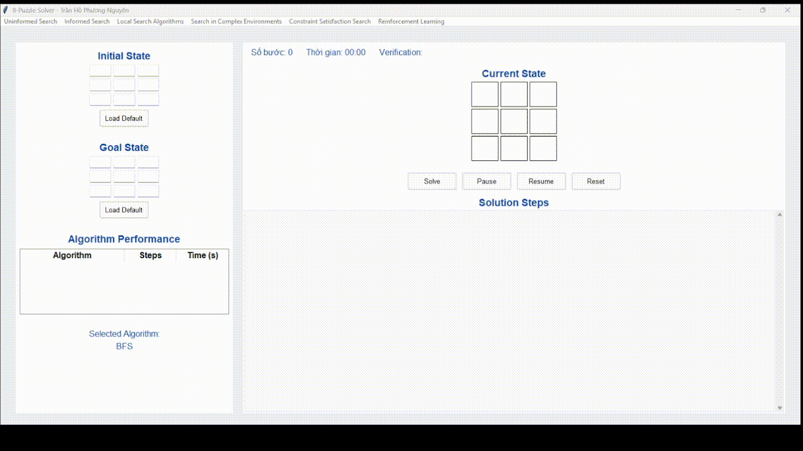

#### 2.1.2. Depth-First Search (DFS)
- Nguyên lý hoạt động: Sử dụng ngăn xếp (stack) để duyệt sâu vào một nhánh trước khi quay lại nhánh khác, giới hạn độ sâu để tránh vòng lặp vô hạn.

- Ưu điểm:
  
Tiêu tốn ít bộ nhớ hơn BFS (chỉ lưu trạng thái trên đường đi hiện tại).

Có thể tìm được lời giải nhanh nếu nhánh đúng được chọn sớm.

- Nhược điểm:

Không đảm bảo tối ưu.

Có thể bị kẹt trong các nhánh sâu không có lời giải.

- Tính phù hợp: Ít phù hợp với 8-puzzle do không đảm bảo tối ưu và dễ bị kẹt trong không gian trạng thái lớn.

#### 2.1.3. Uniform Cost Search (UCS)
- Nguyên lý hoạt động: Mở rộng trạng thái có chi phí thấp nhất (số bước di chuyển) bằng hàng đợi ưu tiên.

- Ưu điểm:

Tìm được lời giải tối ưu nếu chi phí là số bước.

Hoàn chỉnh trong không gian hữu hạn.

- Nhược điểm:
  
Tương tự BFS, yêu cầu bộ nhớ lớn.

Chậm hơn BFS trong trường hợp chi phí đồng nhất.

- Tính phù hợp: Phù hợp khi cần lời giải tối ưu, nhưng không hiệu quả bằng các thuật toán có heuristic.

#### 2.1.4. Iterative Deepening Search (IDS)
- Nguyên lý hoạt động: Kết hợp DFS với giới hạn độ sâu tăng dần, lặp lại cho đến khi tìm được mục tiêu.

- Ưu điểm:

Kết hợp ưu điểm của BFS (tối ưu) và DFS (ít bộ nhớ).

Hoàn chỉnh và tối ưu trong không gian hữu hạn.

- Nhược điểm:

Lặp lại các trạng thái ở các mức độ sâu thấp, gây lãng phí thời gian.

- Tính phù hợp: Phù hợp khi cần tối ưu với bộ nhớ hạn chế, nhưng chậm hơn BFS trong một số trường hợp.

### So sánh các thuật toán
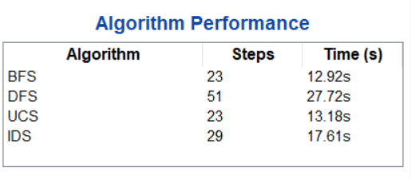

#### Nhận xét
- Thuật toán BFS hoạt động hiệu quả nhất, vừa nhanh vừa ít bước.

- DFS là thuật toán kém hiệu quả nhất, mất nhiều bước và thời gian xử lý lâu.

- UCS cho kết quả tương tự BFS nhưng thời gian xử lý có phần chậm hơn.

- IDS nằm ở mức trung bình, tốt hơn DFS nhưng không bằng BFS và UCS.

### 2.2. Tìm kiếm có thông tin (Informed Search)
#### 2.2.1. Greedy Best-First Search
- Nguyên lý hoạt động: Chọn trạng thái có giá trị heuristic thấp nhất (khoảng cách Manhattan) bằng hàng đợi ưu tiên.

- Ưu điểm:

Nhanh hơn các thuật toán không thông tin do tập trung vào trạng thái gần mục tiêu.

Tiêu tốn ít bộ nhớ hơn BFS.

- Nhược điểm:

Không đảm bảo tối ưu.

Có thể bị kẹt trong các trạng thái cục bộ.

- Tính phù hợp: Phù hợp khi ưu tiên tốc độ hơn tính tối ưu, nhưng cần cải thiện để tránh vòng lặp.

#### 2.2.2. A* Search
- Nguyên lý hoạt động: Kết hợp chi phí thực tế ((g)) và heuristic ((h)) để chọn trạng thái có (f = g + h) thấp nhất.

- Ưu điểm:

Tối ưu và hoàn chỉnh nếu heuristic là admissible (không đánh giá quá cao).

Hiệu quả cao với heuristic tốt.

- Nhược điểm:

Yêu cầu bộ nhớ lớn để lưu trữ các trạng thái.

Phụ thuộc vào chất lượng heuristic.

- Tính phù hợp: Rất phù hợp với 8-puzzle do đảm bảo tối ưu và hiệu quả với heuristic khoảng cách Manhattan.

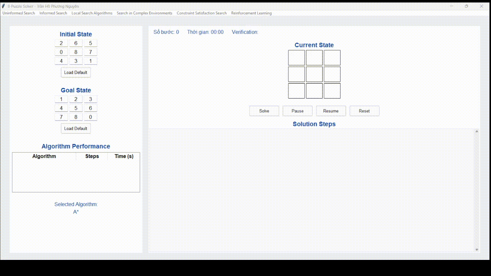

#### 2.2.3. Iterative Deepening A* (IDA*)
- Nguyên lý hoạt động: Kết hợp ý tưởng IDS với A*, sử dụng ngưỡng (f = g + h) để giới hạn tìm kiếm, tăng ngưỡng khi cần.

- Ưu điểm:

Tiêu tốn ít bộ nhớ hơn A* (chỉ lưu đường đi hiện tại).

Tối ưu và hoàn chỉnh với heuristic admissible.

- Nhược điểm:

Có thể lặp lại các trạng thái, gây chậm hơn A* về thời gian.

- Tính phù hợp: Phù hợp khi bộ nhớ hạn chế, nhưng chậm hơn A* trong một số trường hợp.

### So sánh các thuật toán
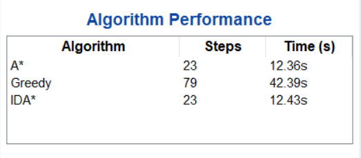

#### Nhận xét
- A* và IDA* cho kết quả tối ưu, cả về số bước lẫn thời gian thực hiện, thể hiện độ hiệu quả và ổn định cao.

- Greedy hoạt động kém hiệu quả, mất nhiều bước và thời gian xử lý lâu hơn đáng kể so với hai thuật toán còn lại.

### 2.3. Tìm kiếm cục bộ (Local Search)
#### 2.3.1. Simple Hill Climbing
- Nguyên lý hoạt động: Chọn trạng thái láng giềng có heuristic thấp nhất, dừng nếu không có trạng thái nào tốt hơn.

- Ưu điểm:

Đơn giản, dễ triển khai.

Tiêu tốn ít bộ nhớ (chỉ lưu trạng thái hiện tại).

- Nhược điểm:

Dễ bị kẹt tại cực trị cục bộ.

Không đảm bảo tối ưu hoặc hoàn chỉnh.

- Tính phù hợp: Ít phù hợp do dễ bị kẹt, nhưng có thể dùng cho các trường hợp đơn giản.

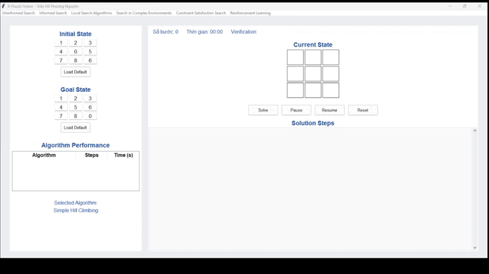

#### 2.3.2. Steepest Ascent Hill Climbing
- Nguyên lý hoạt động: Tương tự Simple Hill Climbing, nhưng luôn chọn trạng thái láng giềng tốt nhất trong tất cả các láng giềng.

- Ưu điểm:

Hiệu quả hơn Simple Hill Climbing trong một số trường hợp.

Tiêu tốn ít bộ nhớ.

- Nhược điểm:

Vẫn dễ bị kẹt tại cực trị cục bộ.

Không đảm bảo tối ưu hoặc hoàn chỉnh.

- Tính phù hợp: Tương tự Simple Hill Climbing, ít phù hợp cho 8-puzzle.

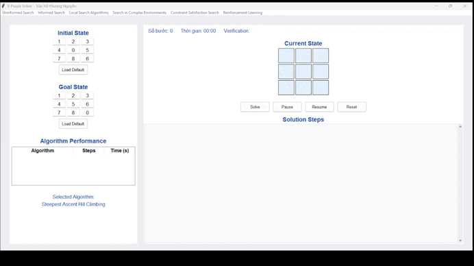

#### 2.3.3. Stochastic Hill Climbing
- Nguyên lý hoạt động: Chọn ngẫu nhiên một trạng thái láng giềng tốt hơn hiện tại, thay vì chọn tốt nhất.

- Ưu điểm:

Có khả năng thoát khỏi cực trị cục bộ nhờ tính ngẫu nhiên.

Tiêu tốn ít bộ nhớ.

- Nhược điểm:

Không đảm bảo tối ưu hoặc hoàn chỉnh.

Phụ thuộc vào yếu tố ngẫu nhiên.

- Tính phù hợp: Phù hợp hơn Simple Hill Climbing, nhưng vẫn không đảm bảo hiệu quả cao.

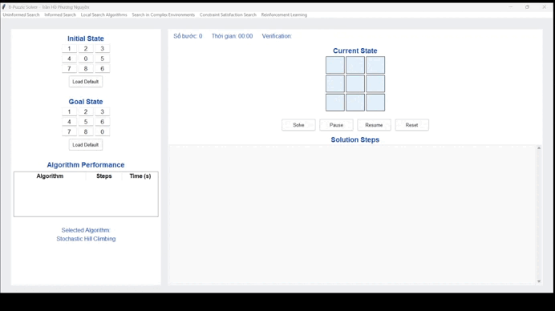

#### 2.3.4. Simulated Annealing
- Nguyên lý hoạt động: Chấp nhận cả trạng thái xấu hơn với xác suất giảm dần (dựa trên nhiệt độ), giúp thoát khỏi cực trị cục bộ.

- Ưu điểm:

Có khả năng tìm lời giải toàn cục nếu điều chỉnh nhiệt độ hợp lý.

Linh hoạt, ít phụ thuộc vào trạng thái ban đầu.

- Nhược điểm:

Phụ thuộc vào tham số nhiệt độ và tốc độ làm nguội.

Không đảm bảo tối ưu hoặc hoàn chỉnh.

- Tính phù hợp: Phù hợp khi cần thoát cực trị cục bộ, nhưng cần điều chỉnh tham số cẩn thận.

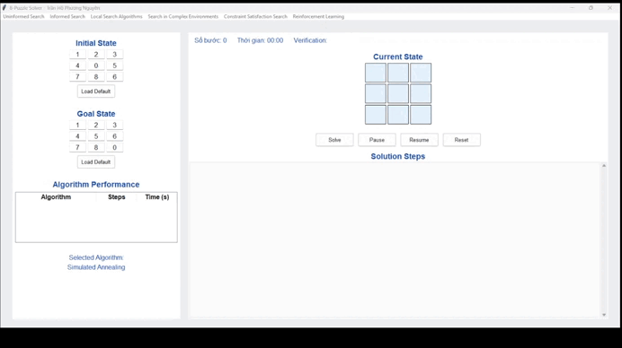

#### 2.3.5. Beam Search
- Nguyên lý hoạt động: Giữ lại một tập hợp trạng thái tốt nhất (beam width) ở mỗi bước, mở rộng từ các trạng thái này.

- Ưu điểm:

Cân bằng giữa tìm kiếm rộng và sâu.

Tiêu tốn ít bộ nhớ hơn BFS.

- Nhược điểm:

Không đảm bảo tối ưu hoặc hoàn chỉnh.

Phụ thuộc vào kích thước beam.

- Tính phù hợp: Phù hợp khi cần giảm bộ nhớ, nhưng hiệu quả phụ thuộc vào beam width.

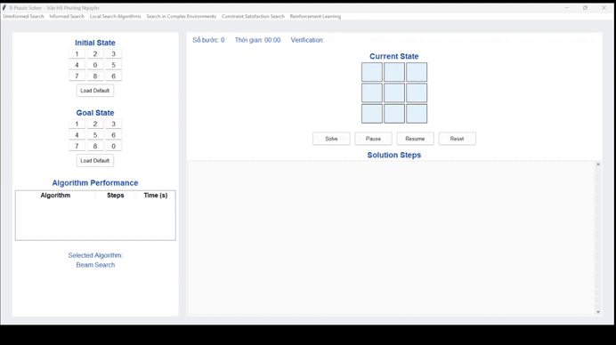

#### 2.3.6. Genetic Algorithm
- Nguyên lý hoạt động: Tạo quần thể các chuỗi di chuyển, tiến hóa qua lai ghép, đột biến, và chọn lọc dựa trên hàm fitness (heuristic).

- Ưu điểm:

Có khả năng tìm lời giải trong không gian lớn.

Linh hoạt, ít phụ thuộc vào trạng thái ban đầu.

- Nhược điểm:

Phụ thuộc vào tham số (kích thước quần thể, tỷ lệ đột biến).

Không đảm bảo tối ưu hoặc hoàn chỉnh.

- Tính phù hợp: Phù hợp cho không gian trạng thái phức tạp, nhưng cần điều chỉnh tham số để hiệu quả.

### So sánh các thuật toán
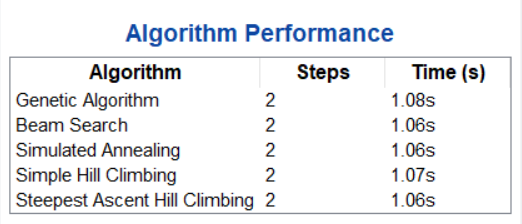
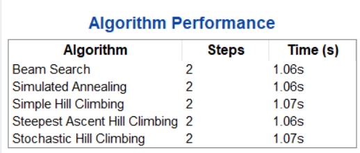

#### Nhận xét
- Các thuật toán Beam Search, Simulated Annealing, Simple Hill Climbing, Steepest Ascent Hill Climbing và Stochastic Hill Climbing đều giải quyết bài toán rất nhanh và với số bước cực kỳ ít, cho thấy chúng hiệu quả cao trong không gian tìm kiếm nhỏ hoặc đơn giản.

- Genetic Algorithm cũng đạt được kết quả tối ưu tương tự như các thuật toán khác, nhưng thời gian thực thi nhỉnh hơn một chút, phản ánh việc thuật toán này phức tạp hơn về mặt xử lý mặc dù vẫn cho kết quả tốt.

### 2.4. Tìm kiếm trong môi trường phức tạp (Complex Search)
#### 2.4.1. Partially Observable Search
- Nguyên lý hoạt động: Duy trì tập hợp trạng thái có thể (belief state), dự đoán và cập nhật dựa trên quan sát, sử dụng heuristic để dẫn hướng.

- Ưu điểm:

Xử lý được các tình huống quan sát không đầy đủ hoặc nhiễu.

Linh hoạt trong môi trường phức tạp.

- Nhược điểm:

Tốn bộ nhớ lớn để lưu trữ belief state.

Độ phức tạp cao, đặc biệt khi tập hợp trạng thái lớn.

- Tính phù hợp: Phù hợp cho các biến thể phức tạp, nhưng không thực tế cho 8-puzzle cơ bản do độ phức tạp cao.

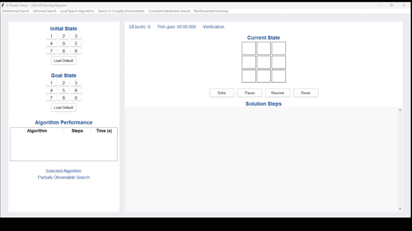

#### 2.4.2. Search with No Observation
- Nguyên lý hoạt động: Chọn di chuyển ngẫu nhiên, kiểm tra tính khả thi của trạng thái sau mỗi bước.

- Ưu điểm:

Đơn giản, không cần thông tin quan sát.

Có thể hoạt động trong môi trường hoàn toàn không xác định.

- Nhược điểm:

Không đảm bảo tìm được lời giải.

Hiệu suất thấp do phụ thuộc vào ngẫu nhiên.

- Tính phù hợp: Ít phù hợp do hiệu suất thấp, chỉ dùng trong trường hợp không có thông tin.

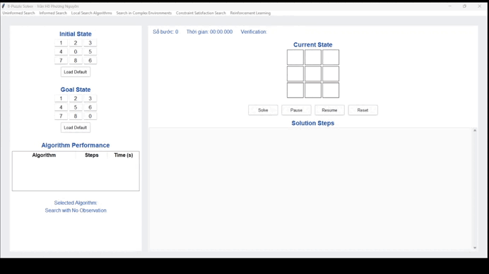

#### 2.4.3. AND-OR Search
- Nguyên lý hoạt động: Xử lý nhiễu bằng cách mô hình hóa môi trường như cây AND-OR, mô phỏng nhiễu ngẫu nhiên.

- Ưu điểm:

Xử lý được nhiễu trong môi trường.

Linh hoạt với các kịch bản không xác định.

- Nhược điểm:

Độ phức tạp cao do cần xem xét nhiều nhánh.

Không đảm bảo tối ưu.

- Tính phù hợp: Phù hợp cho các biến thể có nhiễu, nhưng phức tạp cho 8-puzzle cơ bản.

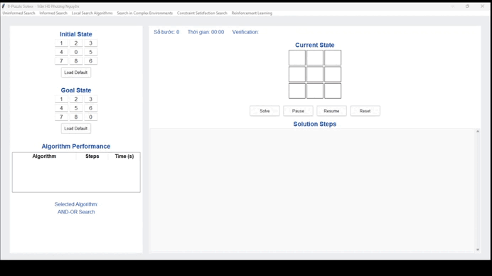

### So sánh các thuật toán

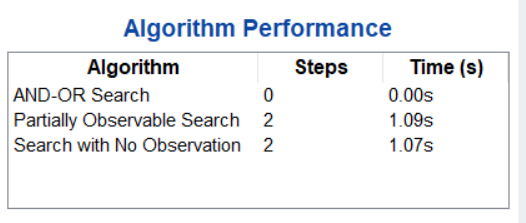

#### Nhận xét
- Search with No Observation chạy nhanh hơn một chút nhưng có thể rủi ro hơn trong môi trường thay đổi.

- Partially Observable Search tuy chậm hơn, nhưng có khả năng thích nghi tốt hơn nhờ sử dụng quan sát.

### 2.5. Tìm kiếm dựa trên ràng buộc (Constraint Satisfaction Search)
#### 2.5.1. AC-3
- Nguyên lý hoạt động: Sử dụng thuật toán AC-3 để loại bỏ các giá trị không thỏa mãn ràng buộc (di chuyển ngược nhau), sau đó dùng backtracking để tìm lời giải.

- Ưu điểm:

Giảm không gian tìm kiếm bằng cách loại bỏ các giá trị không khả thi.

Có thể xử lý các ràng buộc phức tạp.

- Nhược điểm:

Phức tạp trong việc định nghĩa biến và ràng buộc.

Có thể không hiệu quả nếu không gian trạng thái lớn.

- Tính phù hợp: Phù hợp cho các bài toán có ràng buộc rõ ràng, nhưng phức tạp hơn các thuật toán tìm kiếm truyền thống.

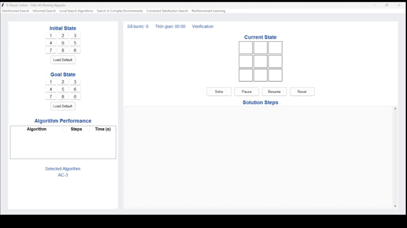

#### 2.5.2. Backtracking Search
- Nguyên lý hoạt động: Duyệt các trạng thái bằng cách thử từng di chuyển, quay lui khi gặp ngõ cụt.

- Ưu điểm:

Đơn giản, dễ triển khai.

Hoàn chỉnh nếu không gian hữu hạn.

- Nhược điểm:

Không tối ưu.

Có thể chậm nếu không gian trạng thái lớn.

- Tính phù hợp: Phù hợp cho các bài toán nhỏ, nhưng không hiệu quả bằng các thuật toán có heuristic.

#### 2.5.3. Forward Checking
- Nguyên lý hoạt động: Kết hợp backtracking với kiểm tra trước để loại bỏ các di chuyển không cải thiện heuristic.

- Ưu điểm:

Giảm không gian tìm kiếm so với backtracking thuần túy.

Hiệu quả hơn backtracking trong một số trường hợp.

- Nhược điểm:

Vẫn không đảm bảo tối ưu.

Phụ thuộc vào chất lượng heuristic.

- Tính phù hợp: Phù hợp khi cần cải thiện backtracking, nhưng không bằng A* hoặc IDA*.

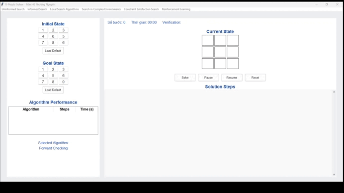

### So sánh các thuật toán

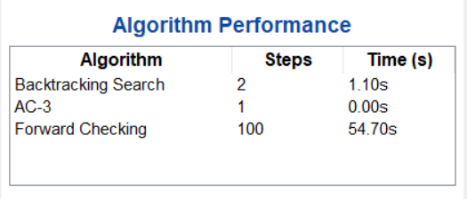

#### Nhận xét
- Backtracking Search là thuật toán cơ bản, hoạt động bằng cách thử từng giá trị một và quay lui khi gặp mâu thuẫn, dễ bị lặp và mất thời gian nếu không được hỗ trợ bởi các kỹ thuật bổ sung.

- AC-3 không trực tiếp tìm lời giải, mà hoạt động như một bước suy luận ràng buộc, giúp đơn giản hóa bài toán bằng cách loại bỏ các giá trị không hợp lệ trong miền biến, nhờ đó tăng hiệu quả cho các thuật toán tìm kiếm phía sau.

- Forward Checking là sự cải tiến của backtracking, giúp phát hiện sớm mâu thuẫn ngay sau mỗi bước gán giá trị, từ đó giảm đáng kể số nhánh vô ích cần xét.

### 2.6. Học tăng cường (Reinforcement Learning)
#### Q-Learning
- Nguyên lý hoạt động: Học chính sách tối ưu bằng cách cập nhật bảng Q-value dựa trên phần thưởng (gần mục tiêu hơn) và khám phá/khai thác.

- Ưu điểm:

Có thể học trong môi trường không xác định.

Linh hoạt, không cần mô hình môi trường.

- Nhược điểm:

Yêu cầu nhiều lần lặp để hội tụ.

Có thể không tìm được lời giải tối ưu.

- Tính phù hợp: Phù hợp cho các bài toán cần học qua thử nghiệm, nhưng không hiệu quả cho 8-puzzle do không gian trạng thái lớn và cần thời gian học lâu.

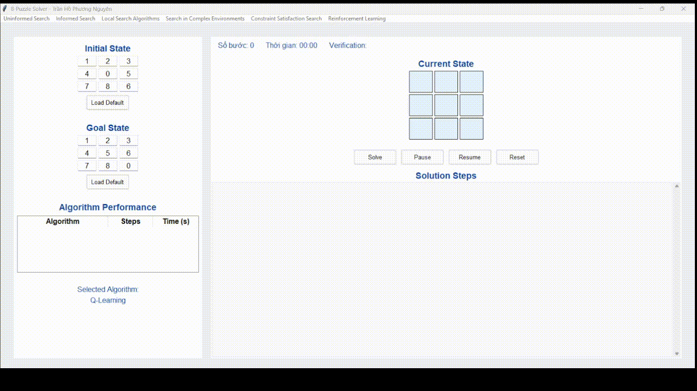

### So sánh các thuật toán
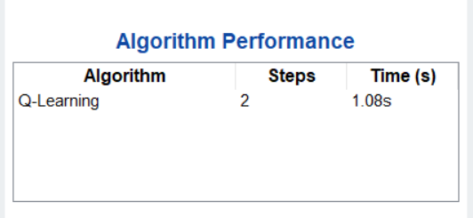

#### Nhận xét 
- Thuật toán Q-Learning đạt hiệu suất rất tốt với số bước giải tối ưu và thời gian thực thi nhanh. Điều này cho thấy Q-Learning có khả năng học và đưa ra lộ trình hiệu quả trong môi trường đã được huấn luyện, phù hợp cho các bài toán có thể khai thác kinh nghiệm để tối ưu hóa quá trình tìm kiếm.

## 3. Kết luận
### 3.1. Ưu điểm:
- Triển khai thành công các thuật toán tìm kiếm thuộc các nhóm: không thông tin (BFS, DFS, UCS, IDS), có thông tin (Greedy Best-First, A*, IDA*), cục bộ (Hill Climbing, Simulated Annealing, Beam Search, Genetic Algorithm), môi trường phức tạp (Partially Observable Search, AND-OR Search), thỏa mãn ràng buộc (AC-3, Backtracking, Forward Checking), và học tăng cường (Q-Learning).

- Phát triển giao diện đồ họa (GUI) thân thiện, cho phép người dùng nhập trạng thái, chạy thuật toán và so sánh hiệu suất dựa trên số bước di chuyển và thời gian thực thi.

- Phân tích chi tiết các thuật toán, chỉ ra A* và IDA* là tối ưu nhất cho 8-puzzle nhờ sử dụng heuristic khoảng cách Manhattan, trong khi các phương pháp như Simulated Annealing và Q-Learning phù hợp cho các kịch bản cần tốc độ hoặc môi trường không xác định.
  
### 3.2. Ý nghĩa của đồ án:
- Củng cố hiểu biết về các kỹ thuật tìm kiếm trong trí tuệ nhân tạo, từ các phương pháp cơ bản đến nâng cao, giúp nắm rõ ưu, nhược điểm và phạm vi ứng dụng của từng thuật toán.

- Nâng cao kỹ năng lập trình, tư duy logic và nghiên cứu khoa học thông qua việc triển khai thuật toán, xây dựng GUI và phân tích hiệu suất.

- Đặt nền tảng cho việc giải quyết các bài toán thực tế phức tạp hơn, như tối ưu hóa hoặc ra quyết định trong môi trường không chắc chắn.
  
### 3.3. Hạn chế và hướng phát triển:
- Một số thuật toán, như Q-Learning, cần thời gian hội tụ dài, có thể cải thiện bằng cách tối ưu hàm phần thưởng hoặc kết hợp với học sâu.

- GUI có thể được nâng cấp để hiển thị trực quan hóa chi tiết hơn, như biểu đồ không gian trạng thái hoặc thống kê hiệu suất.